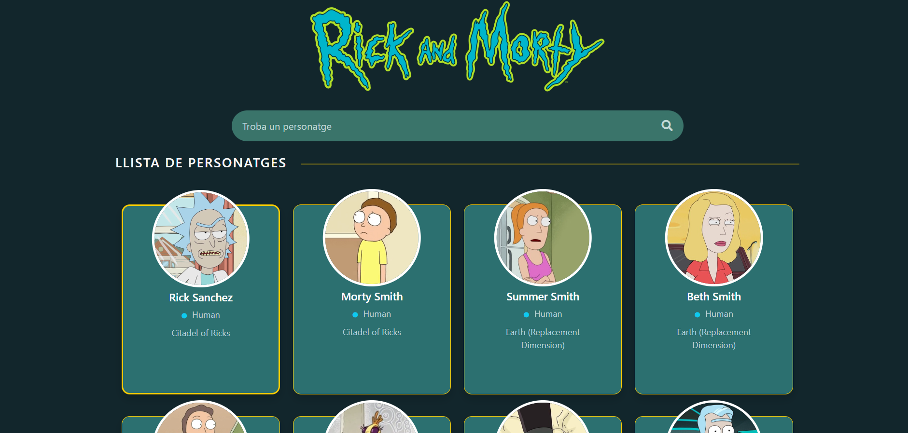

# 🧪 Rick and Morty Character Finder


## 🚀 Description

This project is a web application developed with **Angular** that allows users to search for characters from the popular *Rick and Morty* series. Users can filter characters by name, view detailed information, and explore images of the characters from the show.

## 📸 Screenshots

| Home Screen                                         |
| --------------------------------------------------- |
|       |

---

## 🎨 Features

- 🔍 **Character Search**: You can search for characters by name.
- 🖼️ **Character Display**: Shows the character’s image, species, and location.
- 🖱️ **Responsive Interface**: Adapted to work on large screens, tablets, and mobile devices.
- 🌈 **Attractive Design**: Interface inspired by Rick and Morty’s aesthetic.

---

## 🛠️ Technologies Used

| Technology | Description                                  |
| ---------- | -------------------------------------------- |
|  | Frontend framework based on TypeScript |
|  | CSS design system for responsive layouts |
|  | Vector icons for frontend development |

---

## ⚙️ Installation

1. **Clone the repository**:

  ```bash
  git clone https://github.com/your-username/rick-and-morty-app.git
  ```

2. **Navigate to the project directory:**:

  ```bash
  cd rick-and-morty-app
  ```

3. **Install dependencies:**:

  ```bash
  npm install
  ```

4. **Start the application:**:

  ```bash
  ng serve -o
  ```
The project will be available at http://localhost:4200.

## 🖥️ Usage

1. Access the search bar at the top to search for characters by name.
2. The character list will automatically update as you type.
3. By clicking on a character, you can view additional information such as location, species, and status.

## 🛡️ API Used

This project uses the Rick and Morty API to retrieve detailed character information.

Base URL: https://rickandmortyapi.com/api/
Implemented methods:
GET /character/: Retrieves all characters.

## 📂 Project Structure

  ```bash
├── src/
│   ├── assets/                   # Images and other resources
│   │   └── imgs/                 # Images used in the app
│   ├── app/                      # Angular application code
│   │   ├── components/           # Angular components
│   │   ├── services/             # API logic and services
│   └── environments/             # Environment configuration files
├── README.md                     # Project documentation
└── package.json                  # Project dependencies and configuration
  ```
